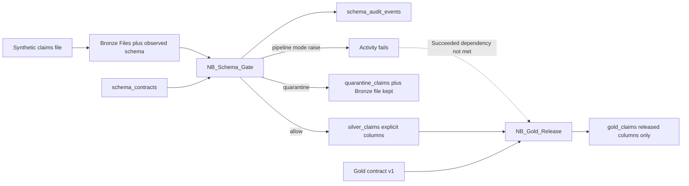

# Schema-drift demo architecture

Synthetic claims walkthrough. It does not contain patient records. Fabric does not ship a schema-contract feature. The notebooks below are the control.

## What each Fabric surface does

| Surface | Role in this demo | What it does not do |
|---|---|---|
| Lakehouse Files | Bronze. The CSV and its observed-schema sidecar are kept as landed. | Does not approve a schema |
| `schema_contracts` | Versioned Silver and Gold contracts. Approval inserts a new version. | Not inferred from the last successful load |
| `NB_Schema_Gate` | Compares observed schema to the active Silver contract, writes `schema_audit_events`, then appends contract columns or writes `quarantine_claims` | Not a built-in Fabric activity |
| Delta write without `mergeSchema` | Refuses a silent column add on append | Not the policy. The contract is the policy |
| `ALTER TABLE` | Applies an additive column only after contract v2 exists | Not used for unapproved files |
| `PL_Schema_Gate` | Runs the gate, then `NB_Gold_Release` only if the gate succeeds | Does not inspect the file by itself |
| `NB_Gold_Release` | Projects the promoted batch onto the Gold contract | Does not inherit new Silver columns |
| Git, deployment pipelines, lineage | Track definition changes and downstream impact after the fact | Do not inspect last night's file |

## Flow

## Decisions the demo must show

1. New optional `place_of_service`: recorded, quarantined, Bronze kept, Silver and Gold unchanged.
2. Missing `claim_id`: quarantined. A missing field plus an added field is not treated as a rename.
3. `billed_amount` decimal to string: quarantined. No automatic cast.
4. Steward inserts Silver contract v2. Version 1 remains. Replay promotes Silver, including the new column, through an explicit `ALTER TABLE`.
5. Gold stays on contract v1. `place_of_service` is not a Gold column.

Audit rows contain field names, types, batch id, decision, and contract version. They do not contain claim values.

## Layer policy

- Bronze: preserve and observe.
- Silver: validate against the active contract before the write.
- Gold: explicit released columns. A Silver approval is not a Gold release.

## Live path

Interactive walkthrough: open `NB_Schema_Gate` and run it with `batch_name = all`. That seeds contracts, runs the three breaks, inserts v2, replays the additive file, and shows Gold columns.

Pipeline path: run `PL_Schema_Gate` with `batch_name = batch-missing`. The gate activity raises. `NB_Gold_Release` does not start.

Local rehearsal, same decisions, no tenant: `python run_demo.py`.
